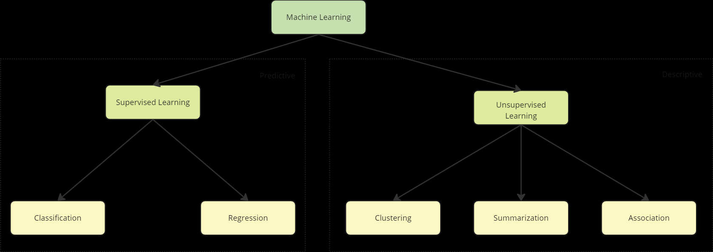
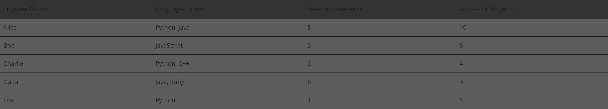
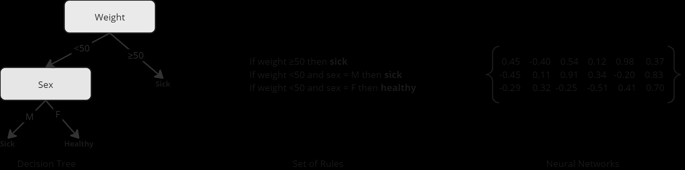

### 1. Learning Tasks
**`Predictive tasks:`** algorithms are applied to a labeled training dataset to induce a predictive model capable of predicting, to a new object represented by the values of its predictive attributes, the value of its target attribute.
Presence of an external supervisor: we know the resulting attribute.
Discrete if Classification. Continuous if Regression.

**`Descriptive tasks`**: instead of predicting a value, algorithms extract patterns from predictive values from the dataset. Unsupervised learning. 
- Clustering(looks for similar objects inside a dataset), Association (associate values from a subset of predictive attributes and values from another subset).
- Summarizing (looks for a simple and compact description for a dataset).

**`Other types of learning`**:
Semi-supervised learning: used when data is not labeled, but some restrictions about the data is known. (add example here)
Reinforcement learning: reinforce or rewards an action considered positive, and punished a negative actions. (add example here)

### 2. Machine Learning and Model Induction
In ML we program devices to learn from experience. For that, we use a a inference principle called INDUCTION (extract generic conclusions from a set of particular examples)

ML algorithms should be able to handle imperfect data. Many datasets include noise, inconsistent data, missing data and redundant data. 
Algorithms should be robust to these problems. But if not, there are pre-processing techniques that help identify, reduce and even eliminate these problems.

When applied to the data, the algorithm should be able to predict something, so that it cn be used in other objects from the same domain but outside the dataset. 
This is necessary for the model to be valid for new objects.

**`Overfitting:`** A model with low capacity of generalization has a rule that is super adjusted to the data. Meaning the model memorized or specialized in the training dataset.

**`Underfitting:`** When the model has low predictive capacity for the training dataset. This happens when the training data are not representative enough, or when the model is too simple and doest capture existing data patterns.

### 3. Inductive Bias
A ML Algorithm looks for a model capable of modeling the relation between predictive attributes and a target attribute.
Each algorithm represents the possible models that can be found using its own format or language. Example: artificial neural networks (real values associated to the weight of the network connections), 
decision trees (tree structure, each knot is a question referred to the value attribute, each knot is associated to a class).

The language or representation used defines a preference, or bias of algorithm representation, restricting the models it can find.

- The way an algorithm looks for a model : search bias

Each algorithm has 2 bias. Representation bias and search bias.
- Bias is necessary to restrict the models to be evaluated in the search space. Without bias, there would be no learning/generalization.